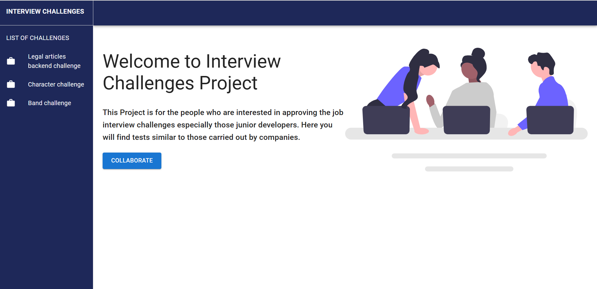

# Interview Challenges Project



This project is an Open-source for the people who are interested in approving the job interview challenges especially those junior developers. Here you will find tests similar to those carried out by companies.

## How to Contribute to this project

1. [Local Development](https://github.com/ezequielbugnon/interview-challenges#local-development)
1. [What you can do](https://github.com/ezequielbugnon/interview-challenges#local-development)

### Local Development

1. Fork the repository first (Click the Fork button in the top right of this page,
   click your Profile Image)
2. Clone the forked repository to your local machine.

```markdown
git clone https://github.com/your-username/devvsakib/power-the-web.git
```

3. change the present working directory

```markdown
cd power-the-web
```
4. Open CMD in your current directory and install npm packages using command.
```markdown
npm install
```
5. Run the project.
```markdown
npm run dev
```

5. Make changes in the project. Add, Commit and Push the project using following commands:

> Create a Branch
```markdown
git checkout -b <name of the branch>
```
- Make the changes
> Add all files
```markdown
git add .
```
> Commit the changes
```markdown
git commit -m "Write Your commit Message"
```
> Push the branch
```markdown
git push
```
OR
```markdown
git push origin branch-name
```
> Make Pull Request from Github Repository
** Star the repository. **

### What you can do

- you can add a new challenge in src/data/challenge.json
- Add new features (please suggest in the issues) like new styles, new functionality. all you deem necessary

### Adding Projects
If you want to add your challenge in repository, you are welcome. Please add your project in "src/data" folder.

Please respect the json structure

If the challenge has no solutions yet you must leave the array empty.

## Tech stack used

| Language   | Badge                                                                                                             |
| ---------- | ----------------------------------------------------------------------------------------------------------------- |
| HTML       |                   |
| CSS        |                      |
| Material-UI   |  |
| JavaScript |  |
| React      |                |
| Vite       |                   |

### Note

- Make Sure you commit your changes in a new branch.
- Make Sure you Give proper name to your files describing the addition.
- Also Make Sure you comment your code wherever necessary.
- Make sure the eslint `Compiled successfully!` doesn't show you a warning.

## Support
Please leave a **STAR⭐**


## License

ProjectsHut is licensed under the [GNU GENERAL PUBLIC LICENSE ](/LICENSE)


